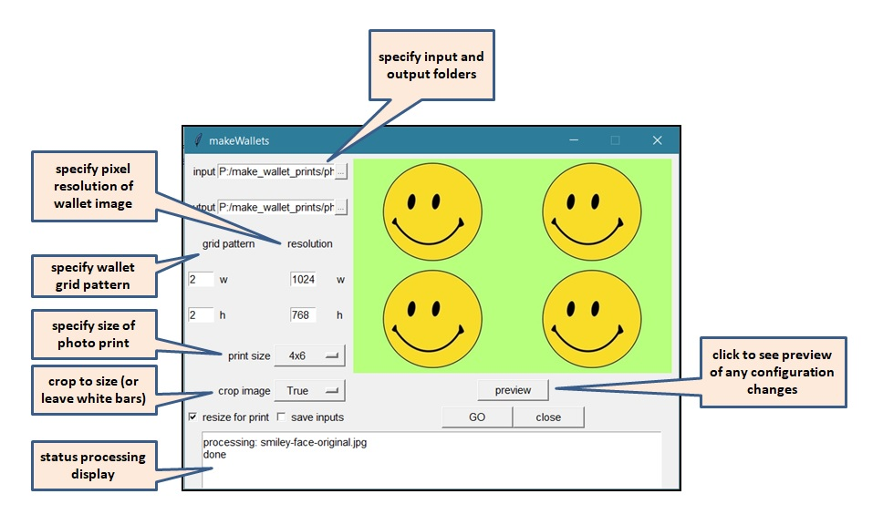

# Make Wallet pictures

Printing wallet photos is expensive. Printing standard photos (4x6) is cheap.

This Python 3 script takes any photo and repackages it as wallet-sized images on standard print sizes (4x6, 5x7, etc). Those standard prints can then manually cut into wallet-size photos.

NOTE: libtile.py is a modified version of Jeffrey Clement's original code Copyright 2003 (unfortunately, I cannot seem to track down a link or the original source - please let me know if you have information)

## 1. Start with some photo

## 2. Script tiles into wallet-size images on standard-size photo paper

## The GUI
A simple GUI is provided to:
1. browse to input and output photo folders
2. specify the standard photo size to use (4x6, 5x7, etc)
3. specify how many wallet size images to create
4. show an image preview
5. run the script to create the wallet images

